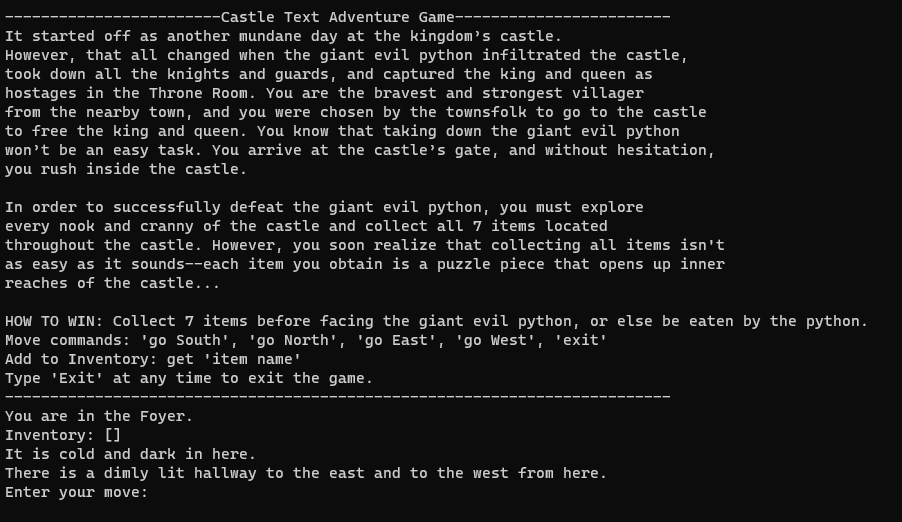

# Python-Text-Adventure-Game
<!-- Improved compatibility of back to top link: See: https://github.com/othneildrew/Best-README-Template/pull/73 -->

<!--
*** Thanks for checking out the Best-README-Template. If you have a suggestion
*** that would make this better, please fork the repo and create a pull request
*** or simply open an issue with the tag "enhancement".
*** Don't forget to give the project a star!
*** Thanks again! Now go create something AMAZING! :D
-->

<!-- PROJECT SHIELDS -->
<!--
*** I'm using markdown "reference style" links for readability.
*** Reference links are enclosed in brackets [ ] instead of parentheses ( ).
*** See the bottom of this document for the declaration of the reference variables
*** for contributors-url, forks-url, etc. This is an optional, concise syntax you may use.
*** https://www.markdownguide.org/basic-syntax/#reference-style-links
-->

<!-- TABLE OF CONTENTS -->

  
Table of Contents

  <ol>
    <li>
      <a href="#about-the-project">About The Project</a>
    </li>
    <li>
      <a href="#built-with">Built With</a>
    </li>
    <li>
      <a href="#getting-started">Getting Started</a>
    </li>
    <li><a href="#contact">Contact</a></li>
  </ol>

<!-- ABOUT THE PROJECT -->
## About The Project

This is my take on the classic choose-your-own-adventure text game written in Python. You must explore the kingdom's castle in order to solve the puzzle before facing the giant evil python! 

The Design Document includes the following: 
* Storyboard (Description and Map)
* Pseudocode

(<a href="#readme-top">back to top</a>)

<!-- BUILT WITH -->
## Built with
 

  

(<a href="#readme-top">back to top</a>)

  

<!-- GETTING STARTED -->
## Getting Started

Download the PythonTextAdventureGame.py file then open!

(<a href="#readme-top">back to top</a>)

<!-- CONTACT -->
## Contact

James Lee - [LinkedIn](https://www.linkedin.com/in/james-lee-a6434310a/) - Jameshblee21@gmail.com

Project Link: [https://jhblee21.github.io/Python-Text-Adventure-Game/](https://jhblee21.github.io/Python-Text-Adventure-Game/)

(<a href="#readme-top">back to top</a>)

